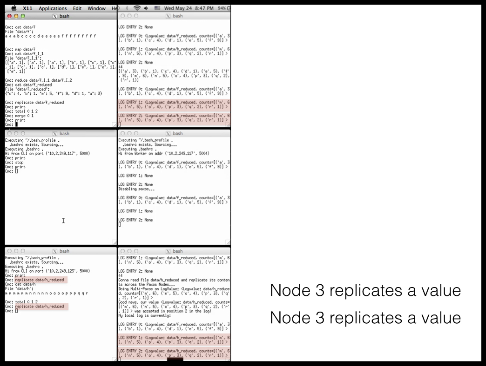

# MapReduce / Paxos class project

A class project that implements MapReduce and Multi-Paxos on a cloud computing infrastructure.

## Table of Contents

- [Video of project](#video-of-project)
- [Project overview](#project-overview)
- [Quick demo of Paxos](#quick-demo-of-paxos)
- [Setting up the code](#setting-up-the-code)
- [Running the code](#running-the-code)
- [Code architecture](#code-architecture)
- [Course details](#course-details)
- [Contact](#contact)


## Video of project

Before you dive in to this readme, maybe you'd prefer watching my video "MapReduce / Paxos class project", which contains 3 parts:

- [0:00 Description of the problem setup](https://youtu.be/4J92zbRWlzk)
- [9:40 Code demo](https://youtu.be/4J92zbRWlzk?t=9m40s)
- [14:36 Explanation of code architecture](https://youtu.be/4J92zbRWlzk?t=14m36s)


## Project overview

The project implements the MapReduce parallel computing algorithm and the Multi-Paxos distributed consensus algorithm.

The code runs on 3 nodes (which may be computers in the cloud or processes running on your local computer); each node is commanded by a human through a command-line interface (CLI). Each node has a large text file on disk and uses MapReduce to parallelize the computation of a word tally of its text file. Then each node uses Multi-Paxos to distribute its tally to its two neighbors in the form of a replicated log. When it completes, each computer has an array of 3 word tallies, one for each text file. Paxos ensures that the arrays are all identical.

Each node runs five processes: a command-line interface, two mappers, a reducer, and a Paxos replication module (PRM). The PRM implements Multi-Paxos to replicate the reducer's output across all three PRMs. Here is how the program lays out the 15 windows (3 nodes * 5 components):


For the class project, we ran our code on three small Linux instances in the Eucalyptus Cloud Computing infrastructure (similar to AWS). However, you can also run the code locally as described below.


- For the full problem statement from the class, please see [`doc/mapreducereplicate.pdf`](doc/mapreducereplicate.pdf).
- For background on Paxos, see my video ["Paxos in Pictures"](https://youtu.be/UUQ8xYWR4do).
- For a video description of the problem statement, see my "MapReduce / Paxos class project" video:
    - [0:00 Description of the problem setup](https://youtu.be/4J92zbRWlzk)


## Quick demo of Paxos

The file `PaxosNode.py` defines the class `PaxosNode` which embodies a node in the Paxos algorithm. Running `PaxosNode.py` runs a local demo of Paxos.

Run this if you just want a quick test of Paxos.

The test itself is very short. It sets up 3 nodes as Python objects and establishes a very simple communication mechanism between them:

```python

def main():

    def send(d,p1,p2,p3):
        if d['to'] == 'a': p1.rx(d)
        if d['to'] == 'b': p2.rx(d)
        if d['to'] == 'c': p3.rx(d)
    
    p1 = PaxosNode('a',['b','c'],lambda d: send(d,p1,p2,p3))
    p2 = PaxosNode('b',['a','c'],lambda d: send(d,p1,p2,p3))
    p3 = PaxosNode('c',['a','b'],lambda d: send(d,p1,p2,p3))

    print("BEFORE:")
    for p in [p1,p2,p3]:
        print(p)            # Their values are all "None"

    p1.initiate_paxos("P1's awesome value")

    print("AFTER P1:")
    for p in [p1,p2,p3]:
        print(p)            # Their values are all "P1's awesome value"

    # Once they've reached consensus, the agreed-upon
    # value can never change. See:

    p2.initiate_paxos("How about P2 gets a turn?")

    print("AFTER P2:")
    for p in [p1,p2,p3]:
        print(p)           # Their values are still "P1's awesome value"


if __name__ == '__main__':
    main()
```


## Setting up the code

You can run the project locally or in the cloud.

### Local setup

1. Ensure you have `xterm` installed. (Mac: install [XQuartz](https://www.xquartz.org/).)
2. Run `run-locally.sh`, which spawns 15 processes in individual `xterm` windows for the CLI, 2 mappers, reducer, and PRM on each of 3 nodes.


### Cloud setup

For the course project, we used the Eucalyptus cloud computing infrastructure (see the Eucalyptus login page at <https://eucalyptus.cloud.eci.ucsb.edu>). The dashboard looks like this:


**Important:** The scripts `copy-to-euc.sh` and `run-eucalyptus.sh` reference an ssh key named `jppucsbcs171-2.pem` that's used to log in to cloud computers. You should replace these references with the name of your own ssh key.

1. Edit `copy-to-euc.sh` to use the IP addresses of your particular cloud instances. Also add the name of your own SSH key.
2. Run `copy-to-euc.sh`, which copies the project files to the three Eucalyptus nodes. (Note: It wipes out the HOME directory on all those nodes!)
3. Edit `run-eucalyptus.sh` to use the IP addresses of your cloud machines.
4. Run `run-eucalyptus.sh`, which starts 15 xterm windows -- one for each of the 3 nodes and 5 components (CLI, 2 mappers, reducer, PRM). 


### After setup

Once you have the 15 xterm windows up, you can type into the 3 nodes' CLIs (the terminal windows in the leftmost column). Type 'h' for a list of valid commands. Type 'k' to kill all processes on a node. 

Now you are ready to run the code.


## Running the code

For a full code demo please see this part in my "MapReduce / Paxos class project" video:

- [9:40 Code demo](https://youtu.be/4J92zbRWlzk?t=9m40s)

The basic idea is to use each of the 3 nodes' CLIs to launch MapReduce jobs and then to distribute their results with Paxos. 

The Paxos part of the code works like this:





For more details, please see the code demo:

- [9:40 Code demo](https://youtu.be/4J92zbRWlzk?t=9m40s)


## Code architecture

For a full discussion of the code architecture, please see my discussion of the code architecture in my "MapReduce / Paxos class project" video: 

- [14:36 Explanation of code architecture](https://youtu.be/4J92zbRWlzk?t=14m36s)

## Course details

- CS 171: Distributed Systems
- Professor Amr El Abbadi (amr@cs.ucsb.edu)
- Spring quarter 2017
- University of California, Santa Barbara
- [CS 171 course website on Piazza](https://piazza.com/class/j0gbt8opotz2rh)


## Contact

[http://justinppearson.com](http://justinppearson.com)


## Table of Contents

- [Video of project](#video-of-project)
- [Project overview](#project-overview)
- [Quick demo of Paxos](#quick-demo-of-paxos)
- [Setting up the code](#setting-up-the-code)
- [Running the code](#running-the-code)
- [Code architecture](#code-architecture)
- [Course details](#course-details)
- [Contact](#contact)
